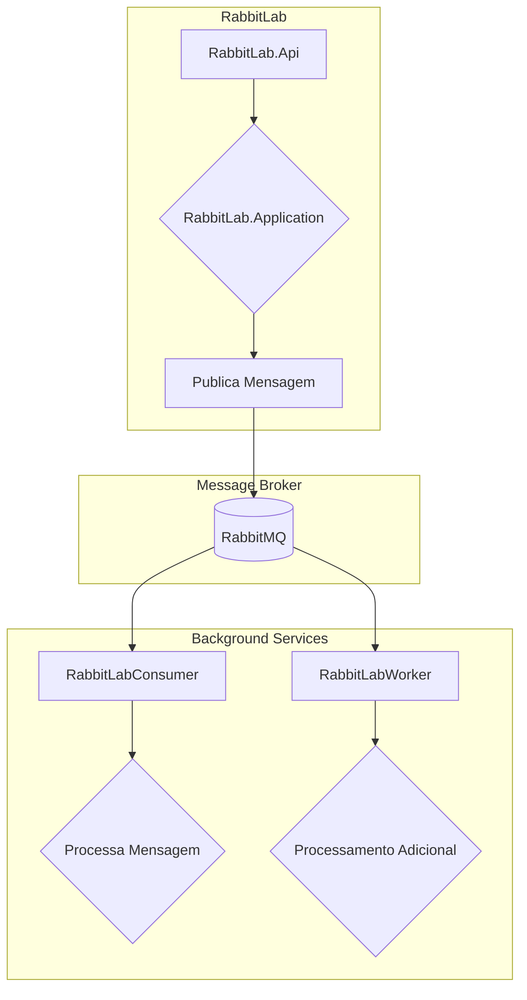

# Processo Assíncrono com RabbitMQ em .NET

Este projeto demonstra um fluxo de processamento assíncrono utilizando RabbitMQ em uma arquitetura .NET.

## Arquitetura

O fluxo de dados segue o seguinte caminho:

1.  A **API** (`RabbitLab.Api`) recebe uma requisição para criar ou atualizar uma pessoa.
2.  A camada de **Aplicação** (`RabbitLab.Application`) processa a requisição e publica uma mensagem em uma fila do RabbitMQ.
3.  O **Consumidor** (`RabbitLabConsumer`) escuta a fila, recebe a mensagem e a processa.
4.  Um **Worker** (`RabbitLabWorker`) pode ser usado para processamento adicional ou em segundo plano das mensagens.

Abaixo está um diagrama que ilustra essa arquitetura:

## Projetos

- `RabbitLab`: Solução principal com a API, regras de negócio e acesso a dados.
  - `RabbitLab.Api`: Ponto de entrada das requisições.
  - `RabbitLab.Application`: Lógica da aplicação e serviços.
  - `RabbitLab.Domain`: Entidades de domínio e interfaces.
  - `RabbitLab.Infra`: Implementação da infraestrutura (ex: repositórios).
- `RabbitLabConsumer`: Serviço que consome mensagens da fila principal.
- `RabbitLabWorker`: Serviço para processamento em segundo plano.

## Como executar

1.  Configure e inicie um container do RabbitMQ.
    - **Usuário:** `guest`
    - **Senha:** `guest`
2.  Configure as `connection strings` nos arquivos `appsettings.json` de cada projeto.
3.  Inicie os projetos `RabbitLab.Api`, `RabbitLabConsumer` e `RabbitLabWorker`.
